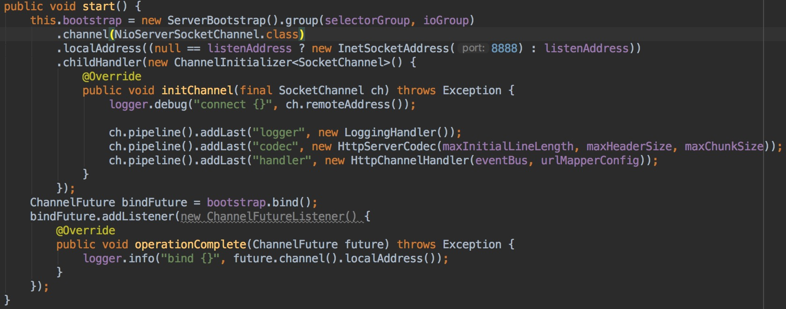

## Welcome to Matry521 Pages

You can use the [editor on GitHub](https://github.com/matry521/matry521.github.io/edit/master/README.md) to maintain and preview the content for your website in Markdown files.

## Java内存模型

&nbsp;&nbsp;&nbsp;&nbsp;&nbsp;&nbsp;Java内存模型的主要目标是定义程序中各个变量的访问规则，即在虚拟机中将变量存储到内存和从内存中取出变量这样底层细节。此处的变量与Java编程时所说的[>>>查看详情](Java内存模型.md)

For more details see [GitHub Flavored Markdown](https://guides.github.com/features/mastering-markdown/).