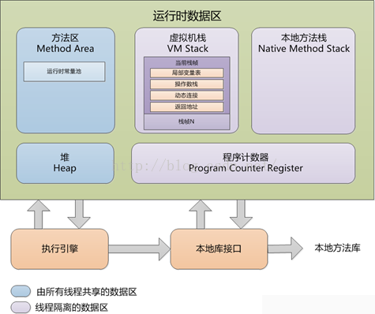
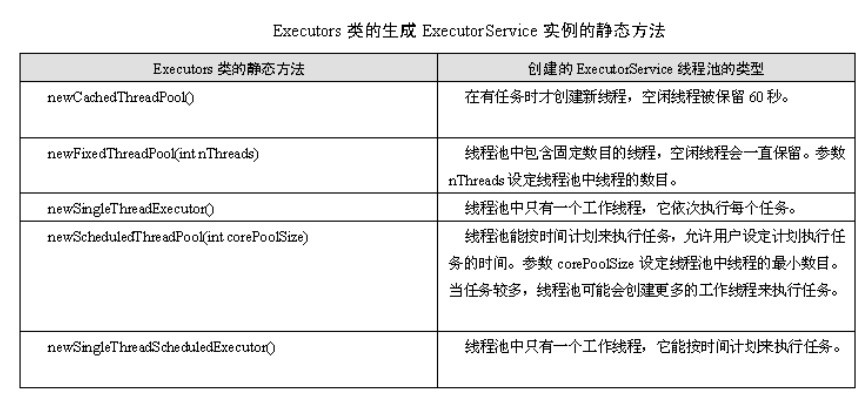

## JVM内存模型

+ **JVM内存模型总体架构图**
    
    
#### **1.程序计数器**  
   是一块较小的内存空间，可看作是当前线程执行字节码行号指示器。分支、循环、跳转、异常处理、
   线程恢复等功能都需要依赖计数器完成。 
   JVM的多线程实现方式：线程轮流切换并分配处理器执行时间。(一个处理器只会执行一条线程中的指令)
   所以，每条线程需要一个独立的程序计数器，各线程间计数器互不影响，独立存储，使得线程切换后能恢复
   到正确的执行位置.(线程私有) 
   (1)若线程正在执行的是一个Java方法，计数器记录的则为正在执行的虚拟机字节码指令的地址 
   (2)若正在执行的是Native方法，计数器值则为空(Undefined) 
   **此内存区域是唯一一个在JVM规范中没有规定任何OutOfMemoryError情况的区域** 
    
#### **2.虚拟机栈**  
   线程私有,与线程相同的生命周期。 
   描述的是Java方法执行的内存模型: **每个方法被执行的时候都会同时创建一个栈帧(Stack Frame)用于
   存储局部变量表、操作栈、动态链接、方法出口等信息.**  
   对于执行引擎来说，活动线程中，只有栈顶的栈帧是有效的，称为**当前栈帧**,这个栈帧所关联的方法称为
   **当前方法**。**执行引擎所运行的所有字节码指令都只针对当前栈帧进行操作**。 

   **(1)局部变量表**  
   一组变量值存储空间，**用于存放方法参数和方法内部定义的局部变量**。Java程序被编译成class文件时
   通过方法Code属性的max_locals数据项配置最大局部变量表的容量。 
   **变量槽(Slot)** 为局部变量表的最小单位。**虚拟机是使用局部变量表完成参数值到参数变量列表的传递
   过程的，** 若为实例方法(非static),局部变量表的第0位索引的Slot默认是用于传递方法所属对象实例的
   引用，在方法中通过this访问。 
   Slot是可重用的，当Slot中变量超出了作用域，在下次分配Slot时候，将会覆盖原来的数据。 
   Slot对对象的引用会影响GC(要是被引用，将不会被回收). 
   **系统不会为局部变量赋予初始值(实例变量和类变量都会被赋予初始值)**。 
   
   **(2)操作数栈**  
   一个以字长为单位的数组。和局部变量区不同的是，不是通过索引来访问，而是通过标准的栈操作(压栈和出栈)
   来访问的。 
   虚拟机把操作数栈作为它的工作区——大多数指令都要从这里弹出数据，执行运算，然后把结果压回操作数栈。 
   
   **(3)动态链接**  
   **静态解析**:符号引用在类加载阶段或者第一次使用的时候转化为直接引用 
   **动态链接**:符号引用在运行期间转化为直接引用 
   
   **(4)返回地址**  
   **正常退出**:退出后会根据方法的定义来决定是否要传返回值给上层调用者。调用者的PC计数器的值可作
   为返回地址 
   **异常退出**:不会传返回值给上层的调用方法。需要通过异常处理表来确定返回地址。 
   
   **(5)异常**  
   JVM规范中，规定了两种异常状况: 
   **StackOverflowError异常**:线程请求的栈深度大于虚拟机所允许的深度。 
   **OutOfMemoryError异常**:虚拟机可以动态扩展，当扩展时无法申请到足够的内存。 
    
#### **3.本地方法栈**  
   **与虚拟机栈区别**:虚拟机栈是虚拟机执行Java方法(字节码)服务，本地方法栈为虚拟机使用到Native方法服务。 
   本地方法栈区也会抛出**StackOverflowError** 和 **OutOfMemoryError** 异常。 
    
#### **4.堆**  
   Java堆是被所有线程共享的一块内存区域，在**虚拟机启动时创建**。**此内存区域的唯一目的就是存放对象实例，**
   几乎所有对象实例都在这里分配内存。(JIT编译器发展与逃逸分析技术例外) 
   **堆是垃圾收集器管理的主要区域**，很多时候也被称为""**GC堆**" 
   **-Xms**:JVM启动时申请的最小内存，默认为**操作系统**物理内存的1/64但小于1G  
   **-Xmx**:JVM可申请的最大内存，默认为物理内存的1/4但小于1G。 
   
   当空余堆内存小于**40%** 时，JVM会增大Heap的大小到-Xmx指定的大小，可通过-XX:MinHeapFreeRation=来指定这个比例； 
   当空余堆内存大于**70%** 时，JVM会减少heap的大小到-Xms指定的大小，可通过-XX:MaxHeapFreeRation=来指定这个比例. 
    
   **新生代**:**程序新创建的对象都是从新生代分配内存**，由**Eden Space**和两块大小相同的**Survivor Space**
   (通常又称S0和S1或From和To)构成，可通过 **-Xmn**参数指定大小，也可通过 **-XX:SurvivorRation**来调整大小。 
   **老年代**:用于存放经过多次新生代GC仍然存活的对象。 
   
   新建对象可直接进入老年代的主要是两种情况: 
   **大对象**:通过启动参数设置-XX:PretenureSizeThreshold=1024(单位字节，默认为0)来代表超过多大时不再新生代分配。 
   **大数组对象，且数组无引用外部对象**:老年代所占的内存大小为-Xmx对应的值减去-Xmn对应的值。 
   
   **OutOfMemoryError异常**抛出:在堆中没有内存完成实例分配，并且堆爷无法再扩展时。
    
#### **5.方法区**  
   **类型信息**:被存储在方法区的内存逻辑区中。由类加载器在类加载时从类文件中提出出来的。**类(静态)变量**存储在方法区. 
   JVM为每个已加载的类型都维护一个**常量池**，通过索引进行访问。 

   方法区主要有以下几个特点: 
   (1)**方法区是线程安全的**。由于所有的线程都共享方法区。 
   (2)**方法区大小可不固定，JVM可根据应用需要动态调整**。可通过 **-XX:PermSize和-XX:MaxPermSize**限制大小。 
   (3)**方法区也可被垃圾收集**，当某个类不在使用时，JVM将卸载这个类，进行垃圾回收。 
   
   当方法区无法满足内存分配需求时，讲抛出**OutOfMemoryError**异常。 
   
   
### 总结
   以表格形式展现几个直接的区别，如下: 
   
   名称 | 特征 | 作用 | 配置参数 | 异常 
   ----| ---- |---- |---------| ---
   程序计数器| 占用内存小，线程私有，生命周期与线程相同|大致为字节码行号指示器|无|无
   虚拟机栈 |线程私有，生命周期与线程相同，使用连续的，内存空间|Java方法执行的内存模型，存储局部变量表、操作栈、动态链接、方法出口等信息|-Xss|StackOverflowError OutOfMemoryError
   Java堆  |线程共享，生命周期与虚拟机相同，可以不使用连续的内存地址|保存对象实例，所有对象实例(包括数组)都要在堆上分配|-Xms -Xsx -Xmn|OutOfMemoryError
   方法区   |线程共享，生命周期与虚拟机相同，可以不使用连续的内存地址|存储已经被虚拟机加载的类信息、常量、静态变量、即时编译器后的代码等数据|-XX:PermSize:16M -XX:MaxPermSize:64M|OutOfMemoryError
   运行时常量池|方法区的一部分，具体动态性|存放字面量及符号引用|无|无

+ **JVM内存模型优点**
   
   1.内置基于内存的并发模型:多线程机制 
   2.同步锁Synchronized 
   3.大量线程安全型库包支持 
   4.基于内存的并发机制，粒度灵活控制，灵活度高于数据库锁。 
   5.多核并行计算模型 
   6.基于线程的异步模型 

+ **直接内存** 
   
   可能导致OutOfMemoryError异常出现。 
   JDK1.4新加入了NIO类，引入了基于通道(Channel)和缓冲区(Buffer)的I/O方式，可以使用Native函数库直接分配堆外内存，然后通过
   一个存储在Java堆里面的DirectByteBuffer对象作为这块内存的引用进行操作，避免了在Java堆和Native堆中来回复制数据，提供性能. 
   
+ **堆与栈对比**
 
   名称 | 特证 | 优缺点| 作用
   -----|-----| -----| ----
   堆|很灵活，但不安全|错误的引用逻辑只能在运行时被发现|主要存放引用和基本数据类型
   栈|不灵活，很严格，安全的，易于管理|错误的引用逻辑在编译时就可被发现|用来存放new出来的对象实例
   
+ **内存溢出和内存泄漏**
   
   **内存溢出out of memory**:指程序在申请内存时，没有足够的内存空间供其使用，出现out of memory;例如申请了一个Integer
   ，但给它存了long才能存下的数，则会内存溢出。 
   **内存泄漏memory leak**:指程序在申请内存后，无法释放已申请的内存空间，若内存泄漏堆积，最终会导致out of memory。 
   
   解决此类异常一般方法: 
   (1)通过内存映像分析工具(如Eclipse Memory Analyzer)对dump出来的堆转储快照进行分析，重点确认内存中的对象
   是否是必要的，分清到底是out of memory还是memory leak。 
   (2)若是内存泄漏，可进一步通过工具查看泄漏对象到GC Roots的引用链。掌握了泄漏对象的类型信息及其GC Roots引用链信息，
   就可以比较准确地定位出泄漏代码的位置。 
   (3)若不存在泄漏，对象确实都还必须存活，应当检查虚拟机的堆参数(-Xmx和-Xms),与机器物理内存比较，看是否可以调大，从代码上
   检查是否存在某些对象生命期过长、持有状态时间多长的情况，尝试减少程序运行期的内存消耗。 
   
+ **内存分配过程**
   
   1.JVM尝试为相关Java对象在Eden Space中初始化一块内存区域。 
   2.当Eden空间足够时，内存申请结束，否则进行下一步。 
   3.JVM试图释放在Eden中所有不活跃的对象(这属于1或者更高级的垃圾回收).释放后若Eden空间任然不足以放入对象，
   则试图将部分Eden中活跃对象放入Survivor区。 
   4.Survivor区被用来作为Eden及Old的中间交换区域，当Old区空间足够时，Survivor区对象会被移到Old区，否则
   会被保留在Survivor区。 
   5.当Old区空间不够时，JVM会在Old区进行完全的垃圾收集(0级)。 
   6.完全垃圾收集后，若Survivor及Old区仍然无法存放从Eden复制过来的部分对象，导致JVM无法在Eden区为新对象
   创建内存区域，则出现out of memory错误。 
   
+ **对象访问**

   即使是最简单的访问，也会涉及Java栈、Java堆、方法区这三个最重要内存区域之间的关联关系。 
   不同虚拟机实现的对象访问方式会有所不同，主流的访问方式有两种:**使用句柄**和**直接指针**。
 
## JVM性能优化

+ **JVM性能的人为因素**
   
   1.关键原因:没有正确处理好对象的生命周期。 
   2.需要从需求中找出存在自然界的业务对象，将其对应落实到内存中，成为内存模型In-memory Domain Model。 
   3.有大小边界限制的内存是缓存，没有永远使用不完的内存，缓存=""有边界的"内存。 
   4.缓存是Domain Model对象缓存，不同于传统意义上数据库的定义。 
   5.分布式缓存可以提高巨量数据处理计算能力。 
   
+ **静态属性和方法的特点**

   1.都保存在栈Stack中 
   2.栈内存是共享的，其他线程都可以访问静态属性(全局变量) 
   3.静态方法在Stack中，无法访问Heap中数据。静态方法无法访问普通对象中数据。 
   
+ **性能优化**  
 
   1.线程池:解决用户响应时间长的问题。 
   **原理**:首先启动若干数量的线程，并让其处于睡眠状态，当有新请求时，会唤醒线程池中的某一个睡眠线程来处理请求，处理
   完成后又处于睡眠状态。 
   **好处**: 
   (1)减少在创建和销毁线程上所花时间以及系统资源开销 
   (2)若不采用线程池，有可能造成系统创建大量线程导致消耗完系统内存。 
   
   
   2.数据库连接池 
   一个数据库连接对象均对应一个物理数据库连接，每次操作都打开一个物理连接，使用完后关闭连接。 
   **解决方案(原理)**:在应用程序启动时建立足够的数据库连接，并将这些连接组成一个连接池，由应用程序动态的堆池中的连接进行
   申请、使用和释放。对于多于连接池中连接数的并发请求，应该在请求队列中排队等待，并且应用程序可以根据池中连接的使用率，动态
   增加或减少池中的数量。 
   
   3.JVM参数:可以设置跟内存、垃圾回收相关的一些参数设置 
   (1)针对JVM堆的设置一般，可通过-Xms -Xmx限定其最小、最大值，为防止垃圾收集器在最小和最大直径收缩堆而产生额外的时间，通常
   把最大、最小设置为相同的值。 
   (2)年轻代和老年代将根据默认的比例(1:2)分配堆内存 
   (3)在配置较好的机器上(比如多核、大内存),可以为老年代选择并行收集算法:**-XX:+UserParalleOldGC**,默认为Serial收集 
   (4)线程堆栈设置:理论上在内存不变的情况下，减少每个线程的堆栈，可以产生更多的线程，但实际受限于**操作系统**。 
   (5)可以通过以下参数打Heap Dump信息: 
     + -XX:HeapDumpPath 
     + -XX:+PrintGCDetails
     + -XX:+PrintGCTimeStamps
     + -Xloggc:/user/aaa/dump/heap_trace.txt 
     通过下面参数可以控制OutOfMemoryError时打印堆的信息: 
     + -XX:+HeapDumpOnOutOfMemoryError
     
   4.程序算法调优 
 
## 一台Java服务器可以跑多少个线程

**线程数量 =（机器本身可用内存 - JVM分配的堆内存）/ Xss的值** 
比如我们的容器本身大小是8G，堆大小是4096M，-Xss默认值，可以得出最大线程数量：4096个。 

根据计算公式，得出如下结论： 
+ 结论1：jvm堆越大，系统创建的线程数量越小。
+ 结论2：当-Xss的值越小，可生成线程数量越多。

我们知道操作系统分配给每个进程的内存大小是有限制的，比如32位的Windows是2G。
因此操作系统对一个进程下的线程数量是有限制的，不能无限的增多。经验值：3000-5000左右。 
刚才说的是不考虑系统限制的情况，那如果考虑系统限制呢，主要跟以下几个参数有关系： 
/proc/sys/kernel/pid_max 增大，线程数量增大，pid_max有最高值，超过之后不再改变，而且32，64位也不一样 
/proc/sys/kernel/thread-max 系统可以生成最大线程数量 
max_user_process（ulimit -u）centos系统上才有，没有具体研究 
/proc/sys/vm/max_map_count 增大，数量增多 
   