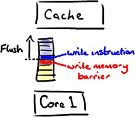

## Java内存模型

+ 什么是Memory Barrier(内存屏障)?

    内存屏障，又称内存栅栏，一个CPU指令： 
    1.保证特定操作的执行顺序。  
    2.影响某些数据（或则是某条指令的执行结果）的内存可见性。
    例如：当插入一条新的Memory Barrier时，这个时候不管什么指令都不能和这条Memory Barrier指令重排序。 
      
    3.Memory Barrier会强制刷出各种CPU cache，volatile是基于Memory Barrier实现的。
    存在private volatile int a; a写入之后会被JMM插入一个Write-Barrier指令，在a被读之前插入一个Read-Barrier指令。可以保证做到如下两点： 
    1.一个线程写入变量a，任何线程访问该变量拿到都是最新值 
    2.对a写入操作，更新数据对其他线程也是可见的。 
    

+ Happens-before
    
    从JDK5开发，java采用新的JSR-133内存模型。 
    在JMM中，如果一个操作的执行结果需要对两一个可见，那么这两个操作之间必然存在happens-before的关系，这两个操作既可以在同一个线程中，也可以在两个不同的线程中。 
    happens-before规则如下: 
    1.程序顺序规则:一个线程中的每个操作，happens-before于该线程中任意的后续操作。 
    2.监视器锁规则:对一个锁的解锁操作，happens-before于随后对这个锁的加锁操作。 
    3.volatile域规则:对一个volatile域的写操作，happens-before于任意线程后续对这个volatile域的读。 
    4.传递性规则:如果A happens-before B，且B happens-before C,那么A happens-before C.  
    
    注意：另个操作之间具有happens-before关系，并不意味前一个操作必须要在后一个操作之前执行。仅仅要求前一个操作的执行结果，
    对于后一个操作是可见的，且前一个操作按顺序排在后一个操作之前。
    
+ 指令重排序
    
    为了提高执行程序时的性能，编译器和处理器会对指令做重排序。JMM通过在不同的编译器和不同的处理器平台之上插入特定类型的
    Memory Barrier来禁止特定类型的便器和处理器重排序，为上层提供一致的内存可见性保证。 
    
    1.编译器优化重排序:在不改变单线程程序语义前提下，可重安排语句执行顺序。 
    2.指令级并行重排序:若不存在数据依赖性，处理器可改变语句对应机器指令的执行顺序。 
    3.内存系统的重排序:处理器使用缓存和读写缓冲区，使得加载和存储操作看上去可能是在乱序执行。 
    
    **数据依赖性** 
    若两个操作访问同一个变量，其中一个为写操作，此时这两个操作之间存在数据依赖性。 
    编译器和处理器不会改变存在数据依赖性关系的两个操作的执行顺序，即不会重排序。 
    
    **as-id-serial**
    不管怎么重排序，单线程下的执行结果不能被改变，编译器、runtime和处理器都必须遵守as-if-serial语义。

+ 抽象结构

    java线程直接的通讯由java内存模型(JMM)控制，JMM决定一个线程对共享变量(实例域、静态域和数组)的写入
    何时对其他线程可见。 
    
    从抽象角度看，JMM定义了线程和主内存Main Memory(堆内存)之间的抽象关系: 
    线程直接的共享变量存储在主内存中，每个线程都有自己的本地内存Local Memory(物理上不存在),存储了该
    线程的共享变量副本。  
    
    综上所述，如果存在A B 线程通讯的话，必须经过以下两步: 
    1.线程A把本地内存中更新过的共享变量刷新到主内存中. 
    2.线程B到主内存中读取线程A之前更新过的共享变量