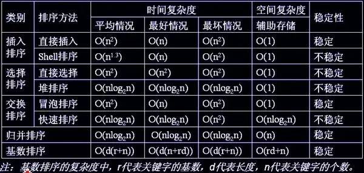

### 排序算法种类
1、内部排序:数据记录在内存中进行排序 
2、外部排序:因排序的数据很大，一次不能容纳全部记录，顾过程中会访问外存

## 常见的内部排序算法有：
1.插入排序 
工作原理:通过构建有序序列，对于未排序书记，在已排序序列中从后向前扫描，找到相应位置并插入。 
2.希尔排序 
即递减增量排序算法，是插入排序的一种更高效的改进版本。是非稳定排序。 
设计思想:先将整个待排序的记录序列分割成为若干子序列分别进行直接插入排序，待整个序列中的记录""基本有序"时，再对全体记录进行一次直接插入排序。 
3.选择排序 
(1)首先在末排序序列中找到最小(大)元素，存放到排序序列的起始位置。 
(2)再从剩余末排序元素中继续寻找最小(大)元素，然后放到已经排序序列的末尾。 
(3)重复第二步，直到所有元素均排序完毕。 
4.冒泡排序 
重复地走访过要排序的数列，一次比较两个元素，如果他们的顺序错误就交换过来。 
(1)比较相邻的元素。如果第一个比第二个大，就交换他们。 
(2)对每一个相邻元素作同样的工作，从开始第一对到结尾的最后一对。这步做完后，最后的元素会是最大的数。 
(3)针对所有的元素重复以上的步骤，除了最后一个。 
(4)持续每次对越来越少的元素重复上面的步骤，知道没有任何一对数字需要比较。 
5.归并排序 
建立在归并操作上的一种有效的排序算法。采用分治法。 
(1)申请空间，使其大小为两个已经排序序列之和，该空间用来存放合并后的序列。 
(2)设定两个指针，最初位置分别为两个已经排序序列的起始位置。 
(3)比较两个指针所指向的元素，选择相对小的元素放入到合并空间，并移动指针到下一位置。 
(4)重复步骤3直到某一指针达到序列尾部。 
(5)将另一序列剩下的所有元素之间复制到合并序列尾。 
6.快速排序 
使用分治法策略来把一个串行(list)分为两个子串行(sub-lists). 
(1)从数列中挑出一个元素，成为""基准"(pivot) 
(2)重新排序数列，所有元素比基准值小的摆放在基准值前面，所有元素比基准值大的摆在基准值的后面(相同的数可以到任一边)。在这个分区退出之后，该基准就处于数列的中间位置。 
(3)递归的把小于基准值元素的子数列和大于基准值元素的子序列排序。 
7.堆排序 
利用堆这种数据结构所涉及的一种排序算法。堆积是一个近似玩去二叉树的结构，并同时满足堆积的性质，即子结点的键值或索引总是小于(或大于)它的父节点。 
堆排序的平均时间复杂度为O(nlogn). 
(1)创建一个堆H[0..n-1] 
(2)把堆首(最大值)和堆尾互换 
(3)把堆的尺寸缩小1，并调用shift_down(0)，目的是把新的数组顶端数据调整到相应位置。 
(4)重复步骤2，直到堆的尺寸为1。 
8.基数排序 
实现原理:讲整数按位数切割成不同的数字，然后按每个位数分别比较。由于整数也可以表达字符串(比如名字或日期)和特定格式的浮点数，所以基数排序也不是只能使用整数。 

###### 总结
各种排序的稳定性，时间复杂度、空间复杂度、稳定性总结如下图：

