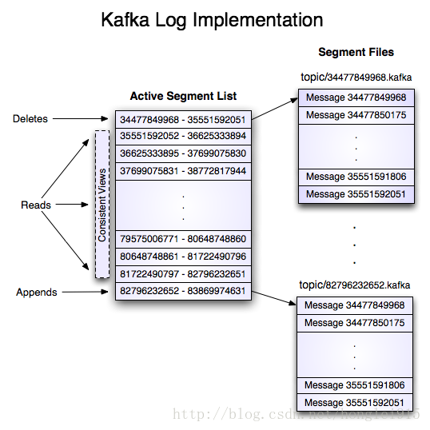

## kafka初识

### 什么是kafka
一个分布式、可分区、可复制的发布/订阅消息系统。主要设计目标如下: 
+ 以时间复杂度为O(1)的方式提供消息持久化能力，即使对TB级以上数据也能保证常数时间复杂度的访问性能。 
+ 高吞吐率。即使在非常廉价的商用机器上也能做到单机美妙100K以上消息的传输。 
+ 支持Kafka Server间的消息分区，及分布式消费，同时保证每个Partition内的消息顺序传输。 
+ 同时支持离线数据处理和实时数据处理。 
+ Scala out: 支持在线水平扩展。 

### kafka名词解释
+ **broker**: Kafka集群包含一个或多个服务器，这种服务器被称为**broker**。server.properties(broker.id=0)配置指定id，正整数唯一递增。 
+ **topic** : 每条发布到Kafka集群的消息都有一个类别，这个类别被称为**topic**。(物理上不同Topic的消息分开存储，逻辑上一个Topic的消息虽然
保存于一个或多个broker上，但用户只需指定消息的Topic即可生产或消费数据，而不必关心数据存于何处) 
+ **productor**: 消息生产者，负责发布消息到Kafka broker。 
+ **consumer** : 消息消费者，从Kafka broker读取消息的客户端。 
+ **offset**: 偏移量，唯一用来标记一条消息在分区中的位置。 
+ **partition**: 是物理上的概念，每个Topic包含一个或多个Partition。(一般为Kafka节点数cpu的总核数) 
+ **consumer group**: 每个consumer属于一个特定的consumer group(可为每个consumer指定group name，若不指定默认为group) 
+ **replication-factor**: 创建topic时的副本数，提供冗余保证可用性。 
+ **isr**: Kafka在zookeeper中动态维护了一个ISR(in-sync replicas) set，这个set里所有replica都跟上了leader，只要ISR里的成员才有被
选为leader的可能。 
+ **zookeeper**: 用来保障分布式应用一致性的软件。 

### 基本特性
#### **1.可扩展性**
+ 在不需要下线的情况下进行扩容 
+ 数据流区(partition)存储在多个机器上

#### **2.高性能** 
+ 单个broker就能服务上千客户端 
+ 单个broker每秒读/写可达几百兆字节 
+ 多个brokers组成的集群将达到非常强的吞吐能力 
+ 性能稳定，无论数据多大 
+ Kafka在底层摒弃了Java堆缓存机制，采用了**操作系统级别的页缓存**，同时将随机写操作改为顺序写，再结合Zero-Copy的特性极大改善了IO性能。

#### **3.持久存储**
+ 存储在磁盘上 
+ 冗余备份到其他服务器上以防止丢失 

### Kafka拓扑结构

如上图，一个典型的Kafka集群中包含若干Producer，若干broker，若干consumer group以及一个zookeeper集群。通过zk管理集群配置，选举leader，
以及在consumer group发生变化时进行Rebalance。producer使用push模式将消息发布到broker，consumer使用pull模式从boker订阅并消费消息。 

### 为何要使用消息系统
+ **解耦**  
在项目启动之初来预测将来项目会碰到的需求是极其困难的。消息系统在处理过程中间插入了一个隐含的、基于数据的接口层，两边的处理过程都要实现这一
接口。这允许你独立的扩展或修改两边的处理过程，只要确保它们遵守同样的接口约束。 
+ **冗余** 
有些情况下，处理数据的过程会失败。除非数据被持久化，否则将造成丢失。消息队列把数据进行持久化直到它们已经被完全处理，通过这一方式规避了数据
丢失风险。许多消息队列所采用的"插入-获取-删除"范式中，在把一个消息从队列中删除之前，需要你得处理系统明确的指出该消息已经被处理完毕，从而确保
你得数据被安全的保存直到你使用完毕。 
+ **扩展性** 
因为消息队列解耦了你得处理过程，顾增大消息入列和处理的频率很容易，只需另外增加处理过程即可，不许修改代码、调整参数。 
+ **灵活性 & 峰值处理能力**  
在访问量剧增情况下，应用仍需继续发挥作用，但这样突发流量并不常见；若以能处理这类峰值访问为标准来投入资源随时待命，这无疑是巨大的浪费。使用消息
队列能够使关键组件顶住突发的访问压力，而不会因为突发的超负荷的请求而完全崩溃。 
+ **可恢复性**  
系统一部分组件失效并不会影响整个系统。消息队列降低了进程间的耦合度，所有即使一个处理消息进行挂掉，加入队列中的消息仍可以在系统恢复后被处理。 
+ **序保证**  
大多数情况下，数据处理顺序很重要。大部分消息队列本来就是排序的，并且能够保证数据会按照特定顺序处理。Kafka保证了一个Partition内消息的有序性。 
+ **缓冲**  
任何重要系统中，都会有需要不同的处理时间元素。例如:加载一张图片比应用过滤器花费更少的时间。消息队列通过一个缓冲层来帮助任务最高效率的执行——写入
队列的处理会尽可能的快速。该缓冲有助于控制和优化数据流经过系统的速度。 
+ **异步通信**  
很多时候，用户不想也不需要立即处理消息。消息队列提供了异步处理机制，允许用户把一个消息放入队列，但并不立即处理它。想向队列中放入多少多可，在
需要的时候再去处理它们。 

### 常用消息队列对比

### kafka参数配置
+ **Broker参数配置**

name|	默认值|	描述
----|--------|------
brokerid|	none	|每一个boker都有一个唯一的id作为它们的名字。 这就允许boker切换到别的主机/端口上， consumer依然知道
enable.zookeeper	|TRUE	|允许注册到zookeeper
log.flush.interval.messages|	Long.MaxValue|	在数据被写入到硬盘和消费者可用前最大累积的消息的数量
log.flush.interval.ms	|Long.MaxValue	|在数据被写入到硬盘前的最大时间
log.flush.scheduler.interval.ms	|Long.MaxValue	|检查数据是否要写入到硬盘的时间间隔。
log.retention.hours|	168	|控制一个log保留多长个小时
log.retention.bytes|	-1|	控制log文件最大尺寸
log.cleaner.enable|	FALSE	|是否log cleaning
log.cleanup.policy|	delete	|delete还是compat. 其它控制参数还包括log.cleaner.threads，log.cleaner.io.max.bytes.per.second，log.cleaner.dedupe.buffer.size，log.cleaner.io.buffer.size，log.cleaner.io.buffer.load.factor，log.cleaner.backoff.ms，log.cleaner.min.cleanable.ratio，log.cleaner.delete.retention.ms
log.dir|	/tmp/kafka-logs	|指定log文件的根目录
log.segment.bytes|	110241024*1024	|单一的log segment文件大小
log.roll.hours|	24 * 7	|开始一个新的log文件片段的最大时间
message.max.bytes	|1000000 + MessageSet.LogOverhead|	一个socket 请求的最大字节数
num.network.threads	|3	|处理网络请求的线程数
num.io.threads	|8	|处理IO的线程数
background.threads	|10	|后台线程序
num.partitions	|1|	默认分区数
socket.send.buffer.bytes	|102400|	socket SO_SNDBUFF参数
socket.receive.buffer.bytes	|102400	|socket SO_RCVBUFF参数
zookeeper.connect	|localhost:2182/kafka|	指定zookeeper连接字符串， 格式如hostname:port/chroot。chroot是一个namespace
zookeeper.connection.timeout.ms	|6000	|指定客户端连接zookeeper的最大超时时间
zookeeper.session.timeout.ms	|6000|	连接zk的session超时时间
zookeeper.sync.time.ms	2000	|zk| follower落后于zk leader的最长时间

+ **High-levelConsumer配置参数**

name	|默认值	|描述
--------|-------|------
groupid	|groupid|	一个字符串用来指示一组consumer所在的组
socket.timeout.ms	|30000|	socket超时时间
socket.buffersize	|64*1024|	socket receive  buffer
fetch.size	|300 * 1024|	控制在一个请求中获取的消息的字节数。 这个参数在0.8.x中由fetch.message.max.bytes,fetch.min.bytes取代
backoff.increment.ms	|1000|	这个参数避免在没有新数据的情况下重复频繁的拉数据。 如果拉到空数据，则多推后这个时间
queued.max.message.chunks	|2|	high level  consumer内部缓存拉回来的消息到一个队列中。 这个值控制这个队列的大小
auto.commit.enable	|TRUE|	如果true,consumer定期地往zookeeper写入每个分区的offset
auto.commit.interval.ms	|10000|	往zookeeper上写offset的频率
auto.offset.reset	|largest|	如果offset出了返回，则 smallest: 自动设置reset到最小的offset. largest : 自动设置offset到最大的offset. 其它值不允许，会抛出异常.
consumer.timeout.ms	|-1|	默认-1,consumer在没有新消息时无限期的block。如果设置一个正值， 一个超时异常会抛出
rebalance.retries.max	|4|	rebalance时的最大尝试次数

+ **Producer配置参数**

name	|默认值	|描述
--------|-------|------
serializer.class|	kafka.serializer.DefaultEncoder	|必须实现kafka.serializer.Encoder接口，将T类型的对象encode成kafka message
key.serializer.class	|serializer.class|	key对象的serializer类
partitioner.class	|kafka.producer.DefaultPartitioner|	必须实现kafka.producer.Partitioner，根据Key提供一个分区策略
producer.type	|sync|	指定消息发送是同步还是异步。异步asyc成批发送用kafka.producer.AyncProducer， 同步sync用kafka.producer.SyncProducer
metadata.broker.list	|boker list|	使用这个参数传入boker和分区的静态信息，如host1:port1,host2:port2, 这个可以是全部boker的一部分
compression.codec	|NoCompressionCodec|	消息压缩，默认不压缩
compressed.topics	|null|	在设置了压缩的情况下，可以指定特定的topic压缩，为指定则全部压缩
message.send.max.retries	|3|	消息发送最大尝试次数
retry.backoff.ms	|300|	每次尝试增加的额外的间隔时间
topic.metadata.refresh.interval.ms	|600000|	定期的获取元数据的时间。当分区丢失，leader不可用时producer也会主动获取元数据，如果为0，则每次发送完消息就获取元数据，不推荐。如果为负值，则只有在失败的情况下获取元数据。
queue.buffering.max.ms	|5000|	在producer queue的缓存的数据最大时间，仅仅for asyc
queue.buffering.max.message	|10000|	producer 缓存的消息的最大数量，仅仅for asyc
queue.enqueue.timeout.ms	|-1|	0当queue满时丢掉，负值是queue满时block,正值是queue满时block相应的时间，仅仅for asyc
batch.num.messages	|200|	一批消息的数量，仅仅for asyc
request.required.acks	|0|	0表示producer毋须等待leader的确认，1代表需要leader确认写入它的本地log并立即确认，-1代表所有的备份都完成后确认。 仅仅for sync
request.timeout.ms	|10000|	确认超时时间

### kafka消息格式

### 日志
每个日志文件都是一个"log entries"序列，每个"log entries"包含一个4字节整形数值(值为N+5)，1个字节的"magic value"，4个字节的CRC校验码，
其后跟N个字节的消息体。每条消息都有一个当前Partition下唯一的64字节的offset，它指明了这条消息的起始位置。这个"log entries"并非一个文件构成，
而是分成多个segment，每个segment以该segment第一条消息的offset命名以".kafka"为后缀。另外会有一个索引文件，它标明了每个segment下包含的log
entry的offset范围，如下图所示:

因为每条消息都被append到该Partition中，属于顺序写磁盘，因此效率非常高(经验证，顺序写磁盘效率比随机写内存还要高)

<!-- 1.kafka节点之间如何复制备份的？
kafka消息是否会丢失？为什么？
kafka最合理的配置是什么？
kafka的leader选举机制是什么？
kafka对硬件的配置有什么要求？
kafka的消息保证有几种方式？-->